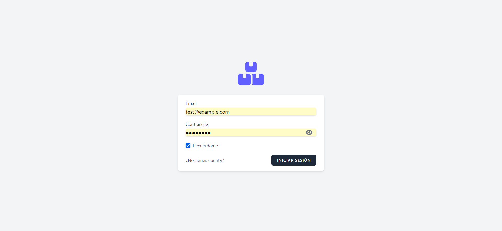

# Sistema de Gestión de Inventario

Este es un proyecto de aplicación web desarrollado como parte de una prueba técnica para el rol de desarrollador de software en SnowWorm. La aplicación permite la gestión de productos y categorías, incluyendo un sistema de autenticación de usuarios.

## 📋 Requisitos del Sistema

Para ejecutar este proyecto en un entorno de desarrollo local, necesitarás tener instalado el siguiente software:

-   **PHP**: Versión 8.2 o superior.
-   **Composer**: Gestor de dependencias para PHP.
-   **Node.js**: Versión 18.0 o superior (para la compilación de assets).
-   **NPM** o **Yarn**: Gestor de paquetes de Node.js.
-   **Base de Datos**: MySQL 8+ o PostgreSQL.

## ⚙️ Instrucciones de Instalación

Sigue estos pasos para configurar el proyecto en tu máquina local:

1.  **Clonar el Repositorio**
    Clona la rama `armando-salcedo` del repositorio:
    ```bash
    git clone -b armando-salcedo [https://github.com/asd1495/prueba-junior.git](https://github.com/asd1495/prueba-junior.git)
    cd prueba-junior
    ```

2.  **Instalar Dependencias de PHP**
    ```bash
    composer install
    ```

3.  **Instalar Dependencias de JavaScript**
    ```bash
    npm install
    ```

4.  **Configurar el Archivo de Entorno**
    Copia el archivo de ejemplo `.env.example` para crear tu propio archivo de configuración.
    ```bash
    cp .env.example .env
    ```

5.  **Generar la Clave de la Aplicación**
    Este es un paso de seguridad para cualquier proyecto de Laravel.
    ```bash
    php artisan key:generate
    ```

6.  **Configurar la Base de Datos**
    Abre el archivo `.env` y modifica las siguientes variables con tus credenciales de base de datos:
    ```env
    DB_CONNECTION=mysql
    DB_HOST=127.0.0.1
    DB_PORT=3306
    DB_DATABASE=gestion_inventario
    DB_USERNAME=root
    DB_PASSWORD=tu_contraseña
    ```
    Asegúrate de crear una base de datos con el nombre que especificaste. **Nota:** Para este proyecto, se utilizó el gestor de bases de datos **MySQL Workbench** para crear el schema `gestion_inventario` antes de ejecutar las migraciones.

7.  **Ejecutar Migraciones y Seeders**
    Este comando creará todas las tablas necesarias y poblará la base de datos con datos de prueba (categorías y productos de ejemplo).
    ```bash
    php artisan migrate:fresh --seed
    ```

8.  **Crear el Enlace Simbólico de Almacenamiento**
    Para que las imágenes subidas sean accesibles públicamente.
    ```bash
    php artisan storage:link
    ```

9.  **Iniciar los Servidores de Desarrollo**
    Necesitas tener dos procesos corriendo en dos terminales separadas:
    
    * **Terminal 1 (Vite - Compilador de Assets):**
        ```bash
        npm run dev
        ```
    * **Terminal 2 (Laravel - Servidor de la Aplicación):**
        ```bash
        php artisan serve
        ```

10. **Acceder a la Aplicación y Cuenta de Prueba**
    Abre tu navegador y visita `http://127.0.0.1:8000`. La aplicación te redirigirá a la página de login. Puedes registrar un nuevo usuario o utilizar la cuenta de prueba creada por los seeders:

    -   **Email:** `test@example.com`
    -   **Contraseña:** `password`

## 💡 Explicación de Decisiones Técnicas Relevantes

### 1. Stack Tecnológico (TALL Stack)
El proyecto se construyó siguiendo los principios del **TALL Stack** (Tailwind CSS, Alpine.js, Laravel, Livewire).

-   **Laravel**: Se eligió como el framework de backend por su robustez, ecosistema maduro y herramientas que agilizan el desarrollo, como el ORM Eloquent y su sistema de rutas.
-   **Livewire**: Fue la elección principal para construir las interfaces de los CRUDs (Categorías y Productos). Se optó por Livewire para crear una experiencia de usuario dinámica y reactiva (búsqueda en tiempo real, formularios en la misma página) sin la necesidad de escribir un frontend complejo en JavaScript. Esto reduce drásticamente el tiempo de desarrollo y mantiene la lógica centralizada en el backend con PHP.
-   **Alpine.js**: Se utilizó como un complemento ligero para pequeñas interacciones en el frontend, como mostrar/ocultar las contraseñas en los formularios de autenticación y manejar los menús desplegables. Su sintaxis declarativa directamente en el HTML lo convierte en el compañero perfecto para Livewire.
-   **Tailwind CSS**: Se usó para el diseño de la interfaz. Su enfoque de "utility-first" permitió construir un diseño limpio, profesional y totalmente responsivo de manera rápida y consistente.

### 2. Autenticación Nativa
Se implementó el sistema de autenticación desde cero haciendo uso de los mecanismos de `rutas`, `controladores`, `middleware` y `sesiones` que Laravel proporciona de forma nativa.

### 3. Interfaz del CRUD Integrada
Se optó por una interfaz de una sola página para la gestión de Categorías y Productos, donde el formulario de creación/edición aparece en la misma vista que el listado. Esta decisión mejora la experiencia de usuario al evitar recargas de página completas y mantener al usuario en el mismo contexto.

## 🚀 Funcionalidades Implementadas (Demo)

A continuación se listan las funcionalidades implementadas en el proyecto.

### 🔒 Módulo de Autenticación
-   [ ] **Registro de Usuario:** Creación de una nueva cuenta con validación de campos.
-   [ ] **Inicio de Sesión:** Autenticación de usuarios existentes.
-   [ ] **Protección de Rutas:** Redirección automática al login si se intenta acceder a una página protegida sin sesión.
-   [ ] **Perfil de Usuario:** Visualización de los datos básicos del usuario (nombre, email, fecha de registro).
-   [ ] **Cierre de Sesión:** Invalidación de la sesión del usuario.

###[Screenshot de login](./screenshots/login.png)
###[Screenshot de registro](./screenshots/register.png)
###[Screenshot de perfil](./screenshots/perfil.png)

### 🛍️ Gestión de Categorías
-   [ ] **Creación de Categoría:** Formulario para añadir una nueva categoría con nombre, descripción e imagen.
-   [ ] **Listado y Búsqueda:** Visualización de categorías con paginación y filtro de búsqueda en tiempo real.
-   [ ] **Edición de Categoría:** Modificación de los datos de una categoría existente.
-   [ ] **Eliminación de Categoría:** Borrado de una categoría con diálogo de confirmación.
-   [ ] **Notificaciones Visuales:** Mensajes de estado para confirmar acciones (crear, editar, eliminar).
-   [ ] **Diseño Responsivo:** La lista se adapta a un formato de tarjetas en dispositivos móviles.

###[Screenshot de categorías](./screenshots/categorias.png)
###[Screenshot de creación de categorías](./screenshots/categorias2.png)

### 🛍️ Gestión de Productos
-   [ ] **Creación de Producto:** Formulario para añadir un nuevo producto con todos sus campos.
-   [ ] **Listado y Búsqueda:** Visualización de productos con paginación y filtro de búsqueda.
-   [ ] **Edición de Producto:** Modificación de los datos de un producto existente.
-   [ ] **Eliminación de Producto:** Borrado de un producto con diálogo de confirmación.
-   [ ] **Tabla Ordenable:** Se puede hacer clic en las cabeceras de la tabla para ordenar los productos por nombre, categoría, precio o cantidad.

###[Screenshot de productos](./screenshots/productos.png)
###[Screenshot de creación de productos](./screenshots/productos2.png)

### 🖥️ Dashboard
-   [ ] **Estadísticas Clave:** Tarjetas que muestran el total de productos, categorías e inventario.
-   [ ] **Listas Dinámicas:** Secciones que muestran los productos añadidos recientemente y aquellos con bajo stock.

###[Screenshot de dashboard](./screenshots/dashboard.png)

### Video demo
[](https://drive.google.com/file/d/1q5rdzszzXGIj_W3m2Tuy8GCmpI5BL_Xn/view?usp=sharing)
